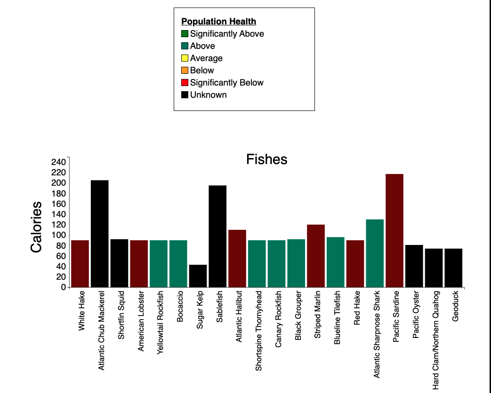

# [Gone-Fishin Live Vesion](https://bphan002.github.io/Gone-Fishin/)

## Instructions
Bar graph can dynamically be rendered to show a fish's calories and the health of a species population by the bar color.
An example graph can be viewed by clicking on the Fish Graph button.
 

 

            <li>The maximum fish you can add to a graph is 20 for desktop, 10 for tablets, and 5 for mobile users</li>
            <li>To create a graph you need to add a fish. You can find a fish by scrolling through the fish tiles or narrow it down with the search bar</li>
            <li>Next click on the image, which will take you to a details page for that fish</li> 
            <li>Click the "Add Fish to Graph" button</li>
            <li>From the same position you can deselect a fish from appearing on the graph by clicking on the remove fish from graph button</li>
            <li>To reset the graph you can reload the page</li>

Should have instructions to layout context for purpose of app and what the user can do in the app like filter for fish and add them to graph.  Also noting where the info came from.	
A Sample Chart can be viewed if you click the Fish Chart button on the header.
The fish's name, calories and a color of the bar graph will show if the fish population is in a health state.

You can dynamically search for a specific fish on the right bubble icon of the header.
A specific fish information can be seen once you click on a fish and a button to add it to the graph or remove it if you accidently added it. 